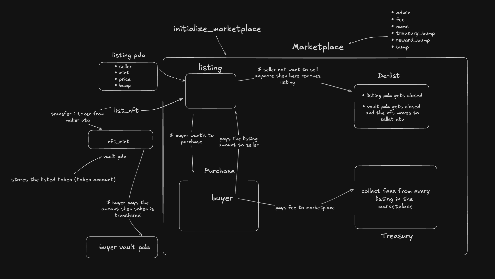

The wokring of the market is based on the following principles:
1. **Marketplace**: A platform where users can buy and sell products or services it looks like .
```bash
pub struct Marketplace{
    pub admin:Pubkey,
    pub fee:u16,
    pub bump:u8,
    pub treasury_bump:u8,
    pub reward_bump:u8,
    #[max_len(32)]
    pub name:String,
}
```

2. **Product Listing**: Sellers can list their products with details which looks like

```bash
pub struct Listing {
    pub seller: Pubkey,
    pub mint: Pubkey,
    pub price: u64,
    pub bump: u8,
}
```
3. **Purchase**: Buyers can purchase products by sending the required amount of tokens to the seller's account.

4. **Treasury**: This account gets the fees from the buyer.

5. **Fee**: A percentage of the purchase price is taken as a fee and sent to the treasury account.

6. **Delisting**: Sellers can delist their products, removing them from the marketplace.

